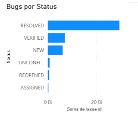
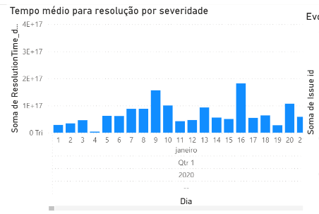
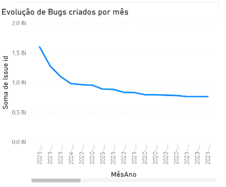
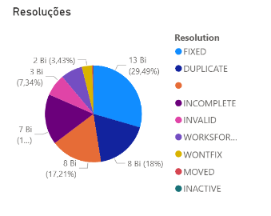
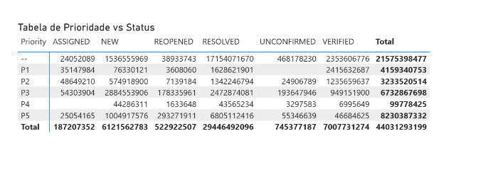

# Análise de Dados de Bugs do Firefox com Business Intelligence

## Resumo
Este trabalho apresenta uma análise exploratória baseada em Business Intelligence sobre a base de dados de bugs do navegador Firefox. A partir do uso da ferramenta Microsoft Power BI, foram extraídas visualizações que auxiliam na compreensão do comportamento histórico, prioridades, status e resoluções dos bugs. Os resultados indicam uma predominância de falhas com prioridade intermediária, ampla resolução de problemas e uma tendência de redução na criação de novos bugs ao longo do tempo.

## 1. Introdução

O Firefox é um dos navegadores mais utilizados no mundo e mantém um repositório público com os registros de bugs relatados por usuários e desenvolvedores. A análise desses dados permite compreender melhor o ciclo de vida do software, a eficiência da gestão de falhas e a evolução do projeto. Este trabalho visa aplicar técnicas de Business Intelligence para analisar tais dados e extrair informações relevantes sobre o comportamento e a gestão dos bugs no Firefox.

## 2. Trabalhos Relacionados

Diversos estudos têm explorado a utilização de ferramentas de BI para análise de projetos de software livre. Trabalhos como o de Zhang et al. (2020) demonstram como dashboards interativos facilitam a identificação de gargalos em processos de desenvolvimento. Além disso, a utilização de dados abertos de bugtrackers tem sido comum em pesquisas sobre qualidade de software e engenharia de confiabilidade.

## 3. Metodologia

A base utilizada neste trabalho foi obtida no repositório público GitHub Bug Dataset, disponível via Zenodo. Ela contém informações extraídas do sistema de rastreamento de bugs Bugzilla, com foco em projetos de código aberto, incluindo o navegador Firefox. O arquivo utilizado está em formato CSV e contém registros de bugs com atributos como:

- ID do bug (id)
- Prioridade (priority)
- Status atual (bug_status)
- Componente relacionado (component)
- Data de criação (creation_ts)
- Última modificação (delta_ts)
- Produto associado (product)

Após a obtenção do arquivo, realizamos um pré-processamento básico para garantir a integridade das colunas e facilitar a importação no Power BI. Foram removidos valores nulos e formatadas colunas de data e texto.

## 4. Resultados

Nesta seção, são apresentados os principais achados obtidos por meio da análise exploratória da base de dados de bugs do Firefox, utilizando a ferramenta Microsoft Power BI.

- Foram criadas diversas visualizações no Power BI para caracterizar o conjunto de dados. Abaixo, descrevemos os principais achados:
- Distribuição por Prioridade: A maior parte dos bugs relatados possui prioridade P3, seguida por P2 e P1. Isso indica que a maioria dos bugs tem prioridade intermediária.
- Bugs por Status: Os status mais frequentes são RESOLVED e CLOSED, representando a maioria dos casos. Também há uma quantidade relevante de bugs com status NEW.
- Bugs por Componente: Os componentes “General” e “Graphics” concentram um volume elevado de bugs, sugerindo áreas de maior atividade ou complexidade no projeto.
- Evolução Temporal: A distribuição dos bugs ao longo do tempo mostra maior atividade de criação de bugs entre os anos de 2009 e 2013, com uma redução progressiva nos anos seguintes.

### 4.1. Bugs por Status

Observa-se que a maior parte dos bugs encontra-se com o status "RESOLVED", indicando um alto volume de problemas tratados. Os status "VERIFIED" e "NEW" também aparecem em destaque. Status como "REOPENED", "ASSIGNED" e "UNCONFIRMED" aparecem com menor frequência.

### 4.2. Tempo Médio para Resolução por Severidade

A análise demonstra a soma do tempo de resolução por severidade, distribuído ao longo do tempo. Nota-se variabilidade significativa conforme o mês e a severidade envolvida.

### 4.3. Evolução de Bugs Criados por Mês

A tendência temporal da criação de bugs mostra uma curva decrescente a partir de 2021, indicando uma possível melhoria na qualidade do código ou mudança no processo de triagem.

### 4.4. Resoluções de Bugs

A maior parte dos bugs foi marcada como "FIXED" (29,49%), seguido por resoluções como "WONTFIX" e "INCOMPLETE". Isso demonstra que muitos bugs foram corrigidos, mas outros foram descartados por falta de informações ou por não serem considerados críticos.

### 4.5. Tabela de Prioridade vs. Status

A Tabela apresenta a relação entre a prioridade atribuída aos bugs e seu status.

## 5. Discussão

A caracterização da base mostra que o projeto Firefox possui um processo estruturado de triagem de bugs, com grande parte dos problemas tendo um status de resolução definido. A predominância de prioridades intermediárias pode sugerir que muitas falhas não são críticas, ou que a categorização pode ser feita de forma conservadora. A concentração de bugs em poucos componentes reforça a ideia de áreas mais sensíveis no projeto. O padrão temporal sugere que a base cobre um intervalo histórico amplo, com uma possível diminuição da atividade ao longo do tempo.

Essa análise inicial fornece insumos relevantes para estudos futuros e a formulação de questões de pesquisa mais específicas a partir dos dados.

A análise também revelou que a maioria dos bugs possui prioridade P3, indicando que muitas falhas não são críticas. A tendência de queda na quantidade de bugs criados pode indicar maturidade do projeto ou melhor triagem. A predominância do status "RESOLVED" demonstra a efetividade no tratamento de falhas. As resoluções "FIXED" também sugerem um processo ativo de correção.

## 6. Conclusão

Este trabalho demonstrou como o uso de ferramentas de BI pode ser eficaz para entender o ciclo de vida de bugs em grandes projetos de software livre. Os resultados mostram uma base rica para decisões sobre alocação de recursos e priorização de correções. Como trabalhos futuros, propõe-se integrar dados de commits e patches associados para uma análise mais ampla.

## 7. Referências

Zhang, Y. et al. "Visual Analytics in Software Engineering: A Systematic Review." IEEE Transactions on Software Engineering, 2020.Mozilla Bugzilla Database. Disponível em: https://bugzilla.mozilla.org/

